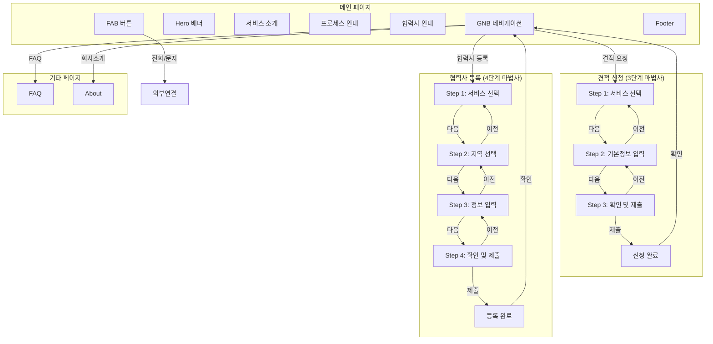
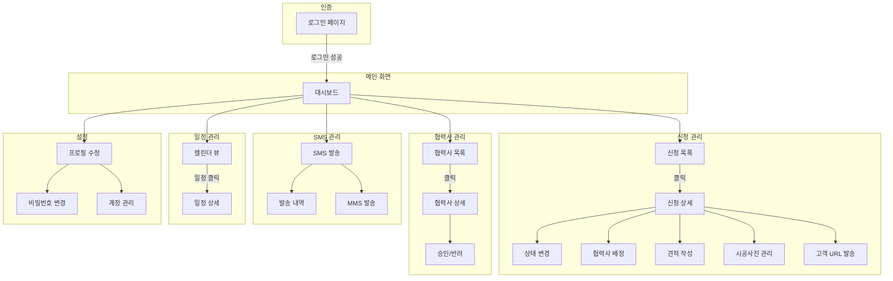
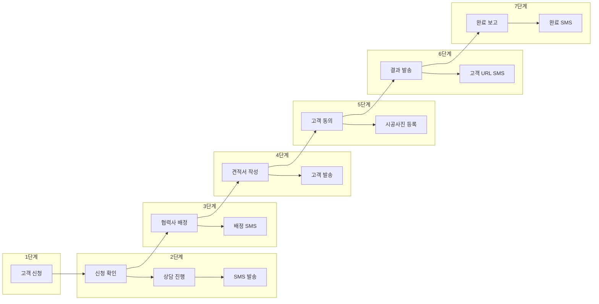
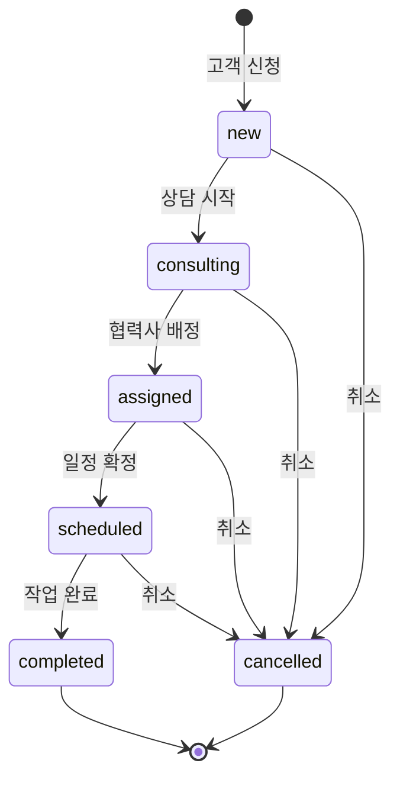
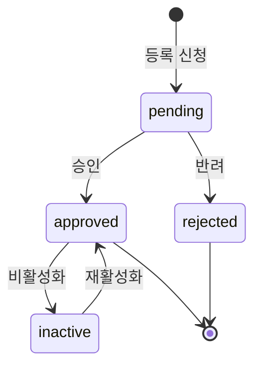
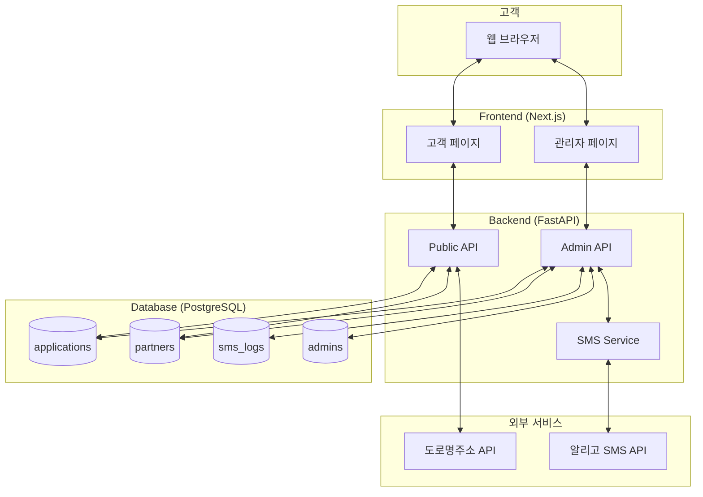

# 전방홈케어 화면 흐름도 v1.0

## 1. 고객 플로우 (Front Office)



---

## 2. 관리자 플로우 (Back Office)



---

## 3. 서비스 프로세스 플로우 (7단계)



---

## 4. 신청 상태 흐름



---

## 5. 협력사 상태 흐름



---

## 6. 페이지별 URL 구조

### Front Office (고객용)
| 페이지 | URL | 설명 |
|--------|-----|------|
| 메인 | `/` | 랜딩 페이지 |
| 견적 신청 | `/apply` | 3단계 마법사 |
| 협력사 등록 | `/partner/register` | 4단계 마법사 |
| FAQ | `/faq` | 자주 묻는 질문 |
| 회사소개 | `/about` | 전방홈케어 소개 |

### Back Office (관리자용)
| 페이지 | URL | 설명 |
|--------|-----|------|
| 로그인 | `/admin/login` | 관리자 로그인 |
| 대시보드 | `/admin` | 현황 요약 |
| 신청 목록 | `/admin/applications` | 신청 관리 |
| 신청 상세 | `/admin/applications/[id]` | 신청 상세 정보 |
| 협력사 목록 | `/admin/partners` | 협력사 관리 |
| 협력사 상세 | `/admin/partners/[id]` | 협력사 상세 정보 |
| SMS 관리 | `/admin/sms` | SMS 발송/내역 |
| 일정 관리 | `/admin/schedule` | 캘린더 뷰 |
| 설정 | `/admin/settings` | 프로필/계정 설정 |

---

## 7. 주요 기능별 접근 경로

### 견적서 발송
```
대시보드 → 신청 목록 → 신청 상세 → 협력사 배정 섹션 → [견적] 버튼 → 견적 모달 → SMS 발송
```

### 시공사진 등록
```
대시보드 → 신청 목록 → 신청 상세 → 협력사 배정 섹션 → [사진] 버튼 → 사진 모달 → 업로드
```

### 고객 결과 URL 발송
```
대시보드 → 신청 목록 → 신청 상세 → 협력사 배정 섹션 → [고객] 버튼 → URL 모달 → SMS 전송
```

### 협력사 승인
```
대시보드 → 협력사 목록 → 협력사 상세 → 승인/반려 버튼
```

### SMS 직접 발송
```
대시보드 → SMS 관리 → 수신자 입력 → 메시지 작성 → 발송
```

---

## 8. 데이터 흐름도



---

**작성일**: 2025-12-30
**버전**: 1.0
